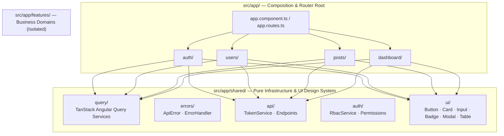

# Angular 19+ Engineering Handbook & Architectural Standard

This handbook is the definitive source of truth for architectural boundaries, design patterns, and philosophies of the **Angular 19+ Master Template (`angular-template-v4`)**.

---

## 1. Architectural Philosophy

This project is a modern, standalone **Angular 19+ Enterprise Application** built with Signals and TanStack Angular Query.

- **Standalone-First**: 100% Standalone Components, directives, and pipes. Zero `NgModule` overhead.
- **Signals-Driven UI**: Reactive state management with `signal()`, `computed()`, and input/output signal APIs.
- **Modern Control Flow**: `@if`, `@for`, and `@switch` syntax for high readability and performant template rendering.
- **Strict Layer Isolation**: FAOS 3-tier boundary separating `features/` (business domains), `shared/` (design system & infrastructure), and `core/` (interceptors & guards).
- **Server State via TanStack Query**: Declarative querying and caching with `@tanstack/angular-query-experimental`.

---

## 2. Layered Architecture

---

## 3. Signal & State Management Patterns

- **UI & Form State**: Signal properties inside standalone components (`readonly isSubmitting = signal(false)`).
- **Authentication State**: `AuthService` exposes `readonly user = signal<User | null>(null)` and `readonly isAuthenticated = computed(() => !!this.user())`.
- **Server State**: `injectQuery()` and `injectMutation()` managing cache keys, background refetches, and optimistic updates.
